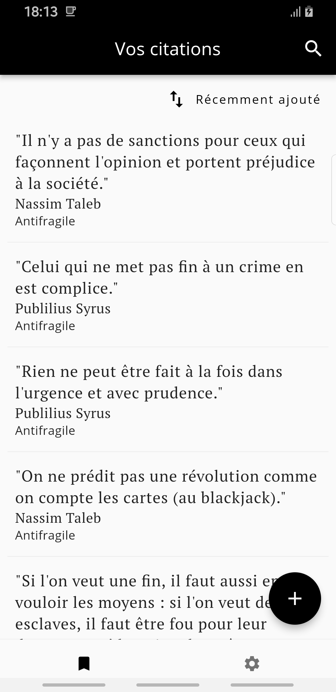
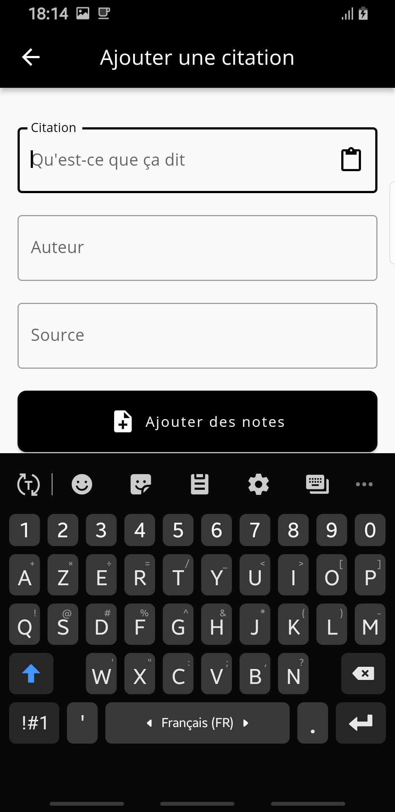
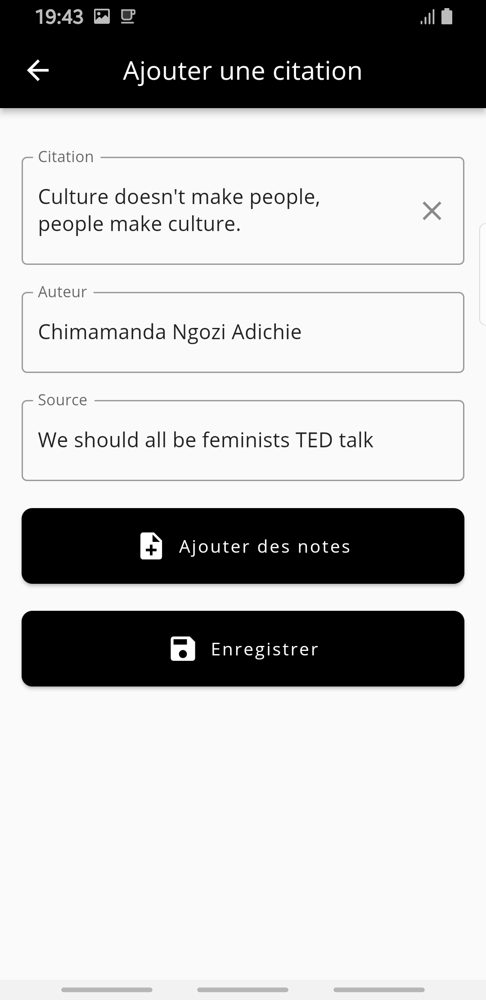
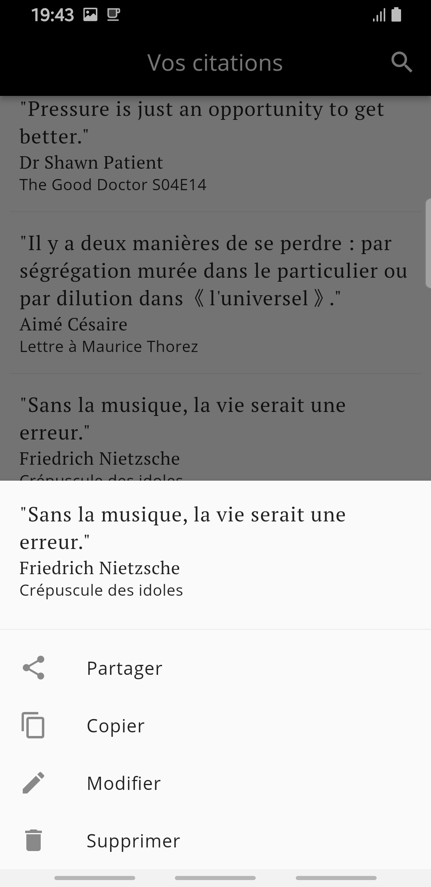

# Meditations

## About

The idea of making this application came to me while I was reading Marcus Aurelius's Meditations. Like many readers, I usually highlight passages that hit me. But, this time, I wanted to have these passages next to me. I didn't want to take the book out of my library and delve into it to find a particular passage. I used to use note-taking apps like Google Keep, but when you start collecting a lot of quotes, things begin being messy. Furthermore, I wanted special features that these apps don't provide. So, that's why I decided to build my quotepad.

## Screenshots

## Features

- Create, modify, delete and share quotes
- Sort quotes by date added, author name and source
- Search
- Autocompletion for authors and sources
- Autopaste, when enabled, paste clipboard content automatically during quote creation
- Export and Import
- Languages: French and English

## Contributing

If it happens to you to use the app and that you find a bug or want to implement a new feature, you are welcome.
Follow these steps to contribute to this repository:

1. Fork the repository
2. Create a branch where you will make your changes
3. Commit your changes
4. Push the branch
5. Open a pull request where you will explain changes being made

## License

See [LICENSE](LICENSE) for more information.
